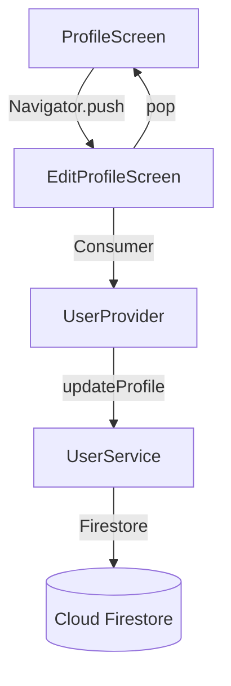

# Design Document: Edit Profile Screen

## Overview

The Edit Profile Screen is a new Flutter screen (`EditProfileScreen`) that allows BrewMaster users to modify their editable profile fields. It is accessed from the existing `ProfileScreen` via the "Edit Profile" button and follows the same form patterns established in `ProfileSetupScreen`.

The screen presents a `Form` widget pre-populated with the user's current `UserProfile` data. Fields are conditionally displayed based on the user's `UserRole` (farmer or buyer). On successful validation and save, the screen calls `UserProvider.updateProfile` and navigates back to the `ProfileScreen`. An unsaved-changes guard prompts the user before discarding edits.

Key design decisions:
- **Reuse existing widgets**: `CustomTextField`, `CustomButton`, `ErrorBanner`, and `StatusBadge` are used directly — no new shared widgets needed.
- **StatefulWidget**: Required for `TextEditingController` lifecycle, `GlobalKey<FormState>`, and dirty-tracking state.
- **Navigator.push / pop pattern**: Consistent with the app's existing imperative navigation (no named routes or GoRouter).
- **Update map approach**: Only changed fields are sent to `UserProvider.updateProfile` as a `Map<String, dynamic>`, matching the existing API contract.

## Architecture

The feature fits into the existing layered architecture:




**Layers involved:**

| Layer | Component | Responsibility |
|---|---|---|
| Presentation | `EditProfileScreen` | Form UI, validation, dirty-tracking, navigation |
| Presentation | `ProfileScreen` (modified) | Adds navigation to `EditProfileScreen` |
| State | `UserProvider` (unchanged) | Calls `updateProfile`, exposes `isLoading` / `errorMessage` |
| Data | `UserService` (unchanged) | Firestore write via `updateUserProfile` |
| Domain | `UserProfile` (unchanged) | Data model with `copyWith`, `toJson`, `fromJson` |

No changes are needed to the state management, data, or domain layers. The feature is purely a presentation-layer addition plus a one-line navigation wiring in `ProfileScreen`.

## Components and Interfaces

### EditProfileScreen (new)

```dart
class EditProfileScreen extends StatefulWidget {
  final UserProfile userProfile;
  const EditProfileScreen({super.key, required this.userProfile});
}
```

**State fields:**
- `_formKey`: `GlobalKey<FormState>` for form validation
- `_displayNameController`: `TextEditingController` — pre-populated with `userProfile.displayName`
- `_photoUrlController`: `TextEditingController` — pre-populated with `userProfile.photoUrl ?? ''`
- Farmer controllers: `_farmSizeController`, `_farmLocationController`, `_coffeeVarietiesController`, `_farmRegNumberController`
- Buyer controllers: `_businessNameController`, `_businessTypeController`, `_monthlyVolumeController`
- `_isSaving`: `bool` — local flag to track save-in-progress (supplements `UserProvider.isLoading`)

**Key methods:**

| Method | Description |
|---|---|
| `_hasChanges()` | Compares current controller values against original `userProfile` fields. Returns `bool`. |
| `_buildUpdateMap()` | Constructs `Map<String, dynamic>` from current form values, including `updatedAt: DateTime.now()`. |
| `_handleSave()` | Validates form, calls `UserProvider.updateProfile`, navigates back on success, shows error banner on failure. |
| `_confirmDiscard()` | Shows `AlertDialog` with "Discard changes?" if `_hasChanges()` is true. |
| `_buildFarmerFields()` | Returns farmer-specific `CustomTextField` widgets. |
| `_buildBuyerFields()` | Returns buyer-specific `CustomTextField` widgets. |

### ProfileScreen (modified)

The existing `onPressed` callback on the "Edit Profile" `CustomButton` changes from a TODO comment to:

```dart
onPressed: () {
  Navigator.push(
    context,
    MaterialPageRoute(
      builder: (_) => EditProfileScreen(userProfile: profile),
    ),
  );
},
```

### Validation Logic

Validation is handled inline via the `validator` parameter on each `CustomTextField`, matching the pattern in `ProfileSetupScreen`:

| Field | Rule | Error Message |
|---|---|---|
| Display Name | `value.trim().isEmpty` → invalid | "Display name is required" |
| Photo URL | Always valid (any string, including empty) | — |
| Farm Size | If non-empty: `double.tryParse` fails or `<= 0` → invalid | "Enter a valid farm size" |
| Monthly Volume | If non-empty: `double.tryParse` fails or `< 0` → invalid | "Enter a valid volume" |
| All other text fields | No validation (optional free text) | — |

### Unsaved Changes Guard

`_hasChanges()` logic:

```
displayName != original.displayName
|| photoUrl != (original.photoUrl ?? '')
|| (role == farmer && any farmer field differs)
|| (role == buyer && any buyer field differs)
```

When `_hasChanges()` is true and the user taps back, `_confirmDiscard()` shows:
- Title: "Discard changes?"
- Actions: "Cancel" (stays on screen), "Discard" (pops without saving)

This is implemented via `WillPopScope` (or `PopScope` on Flutter 3.16+) wrapping the `Scaffold`.

## Data Models

No new data models are introduced. The feature operates on the existing `UserProfile` model.

**Update map structure** (sent to `UserProvider.updateProfile`):

```dart
{
  'displayName': String,
  'photoUrl': String?,
  'updatedAt': Timestamp,
  // Farmer-specific (only if role == farmer):
  'farmSize': double?,
  'farmLocation': String?,
  'coffeeVarieties': List<String>?,
  'farmRegistrationNumber': String?,
  // Buyer-specific (only if role == buyer):
  'businessName': String?,
  'businessType': String?,
  'monthlyVolume': double?,
}
```

The `coffeeVarieties` field is stored as a `List<String>` in Firestore but edited as a comma-separated string in the UI. The conversion is: `text.split(',').map((e) => e.trim()).where((e) => e.isNotEmpty).toList()`.


## Correctness Properties

*A property is a characteristic or behavior that should hold true across all valid executions of a system — essentially, a formal statement about what the system should do. Properties serve as the bridge between human-readable specifications and machine-verifiable correctness guarantees.*

### Property 1: Pre-population round trip

*For any* valid `UserProfile`, when the `EditProfileScreen` is initialized with that profile, every editable field's controller text should equal the corresponding profile field value (with `null` mapped to empty string, `List<String>` joined by `', '`, and `double` converted via `toString()`).

**Validates: Requirements 2.1, 2.2, 2.3, 2.4**

### Property 2: Role-based field visibility

*For any* valid `UserProfile`, the set of visible role-specific fields should exactly match the user's role — farmer profiles show only farmer fields, buyer profiles show only buyer fields, and the opposite role's fields are absent.

**Validates: Requirements 3.1, 3.2, 3.3, 3.4**

### Property 3: Display name rejects whitespace-only input

*For any* string composed entirely of whitespace characters (including the empty string), the display name validator should return the error message "Display name is required". *For any* string that contains at least one non-whitespace character, the validator should return `null`.

**Validates: Requirements 4.1, 4.2**

### Property 4: Numeric field validation

*For any* string input to a numeric field (Farm Size or Monthly Volume), the validator should return `null` if and only if the string is empty OR parses to a number within the field's valid range (positive for Farm Size, non-negative for Monthly Volume). Otherwise, the validator should return the appropriate error message.

**Validates: Requirements 4.3, 4.4, 4.5, 4.6**

### Property 5: Photo URL accepts all strings

*For any* string value (including empty string), the Photo URL validator should return `null` (valid).

**Validates: Requirements 4.7**

### Property 6: Update map construction

*For any* valid form state derived from a `UserProfile`, the generated update map should contain: all editable field values matching the current form controller text (with proper type conversions), an `updatedAt` field with a `DateTime` value, and only the fields relevant to the user's role.

**Validates: Requirements 5.1, 5.5**

### Property 7: Dirty detection symmetry

*For any* `UserProfile` and any set of form field modifications, `_hasChanges()` returns `true` if and only if at least one controller value differs from the original profile field value. When no modifications have been made, `_hasChanges()` returns `false`.

**Validates: Requirements 6.1, 6.4**

## Error Handling

| Scenario | Handling |
|---|---|
| `UserProvider.updateProfile` returns `false` | Display `UserProvider.errorMessage` in an `ErrorBanner` at the top of the form. The user can dismiss it or retry. |
| `UserProvider.updateProfile` throws | The provider catches exceptions internally and sets `errorMessage`. The screen reads this via `Consumer<UserProvider>`. |
| Network timeout during save | Handled by `UserService` / Firestore SDK. Surfaces as an error message through the provider. |
| Form validation failure | Standard Flutter form validation — error messages appear below the respective fields. The save action is blocked. |
| Back navigation with unsaved changes | `PopScope` / `WillPopScope` intercepts the pop, shows a confirmation dialog. User chooses to discard or stay. |
| Null `photoUrl` on profile | Pre-populated as empty string. Saved back as `null` if empty, or as the entered string. |

## Testing Strategy

### Property-Based Tests

Use the `dart_check` package (or `glados` if already in the project) for property-based testing. Each property test runs a minimum of 100 iterations with randomly generated `UserProfile` instances and form inputs.

Each test must be tagged with a comment referencing the design property:
```
// Feature: edit-profile-screen, Property {N}: {title}
```

| Property | Test Description | Generator |
|---|---|---|
| 1: Pre-population round trip | Generate random `UserProfile`, verify controller initialization | Random `UserProfile` with varied field values |
| 2: Role-based field visibility | Generate random `UserProfile`, verify visible field set matches role | Random `UserProfile` with random `UserRole` |
| 3: Display name whitespace rejection | Generate random whitespace strings and non-whitespace strings, verify validator output | Random strings (whitespace-only and mixed) |
| 4: Numeric field validation | Generate random strings, verify validator accepts valid numbers and rejects invalid | Random strings including numbers, negatives, text |
| 5: Photo URL accepts all | Generate random strings, verify validator always returns null | Random strings |
| 6: Update map construction | Generate random `UserProfile` and form values, verify map contents | Random `UserProfile` + random form edits |
| 7: Dirty detection symmetry | Generate random `UserProfile`, apply random edits, verify `_hasChanges()` | Random `UserProfile` + random subset of field changes |

### Unit Tests

Unit tests cover specific examples, edge cases, and integration points:

- Navigation: Tapping "Edit Profile" pushes `EditProfileScreen` with correct profile
- Navigation: Successful save pops back to `ProfileScreen`
- Navigation: Back button without changes pops without dialog
- Navigation: Back button with changes shows discard dialog
- UI: AppBar shows "Edit Profile" title
- UI: Role and verification status displayed as read-only labels
- UI: Loading indicator shown on save button during save
- UI: Save button disabled during save
- UI: Error banner shown when save fails
- Edge cases: Profile with all null optional fields
- Edge cases: Coffee varieties with trailing commas, extra spaces
- Edge cases: Farm size of exactly 0 (invalid) vs 0.01 (valid)
- Edge cases: Monthly volume of exactly 0 (valid) vs -1 (invalid)

### Test File Organization

```
test/
  presentation/
    screens/
      profile/
        edit_profile_screen_test.dart          # Unit + widget tests
  properties/
    edit_profile_form_properties_test.dart      # Property-based tests
```
